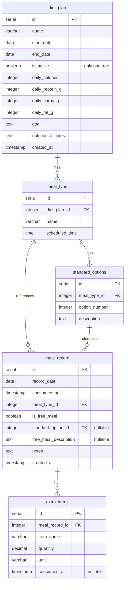

```mermaid
erDiagram
    diet_plan ||--o{ meal_type : "has"
    meal_type ||--o{ standard_options : "has"
    meal_type ||--o{ meal_record : "references"
    standard_options ||--o{ meal_record : "references"
    meal_record ||--o{ extra_items : "has"

    diet_plan {
        serial id PK
        varchar name
        date start_date
        date end_date
        boolean is_active "only one true"
        integer daily_calories
        integer daily_protein_g
        integer daily_carbs_g
        integer daily_fat_g
        text goal
        text nutritionist_notes
        timestamp created_at
    }

    meal_type {
        serial id PK
        integer diet_plan_id FK
        varchar name
        time scheduled_time
    }

    standard_options {
        serial id PK
        integer meal_type_id FK
        integer option_number
        text description
    }

    meal_record {
        serial id PK
        date record_date
        timestamp consumed_at
        integer meal_type_id FK
        boolean is_free_meal
        integer standard_option_id FK "nullable"
        text free_meal_description "nullable"
        text notes
        timestamp created_at
    }

    extra_items {
        serial id PK
        integer meal_record_id FK
        varchar item_name
        decimal quantity
        varchar unit
        timestamp consumed_at "nullable"
    }
```