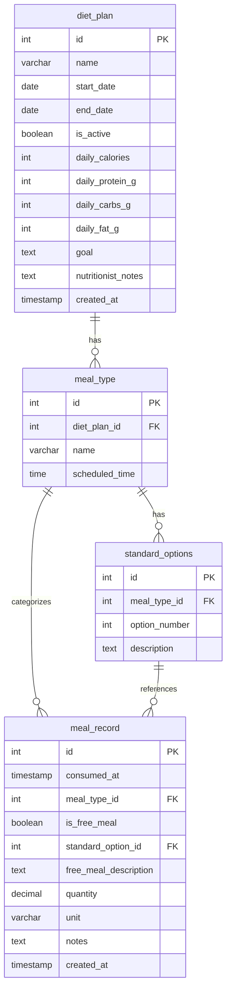

```mermaid
erDiagram
    diet_plan ||--o{ meal_type : "has"
    meal_type ||--o{ standard_options : "has"
    meal_type ||--o{ meal_record : "categorizes"
    standard_options ||--o{ meal_record : "references"

    diet_plan {
        int id PK
        varchar name
        date start_date
        date end_date
        boolean is_active
        int daily_calories
        int daily_protein_g
        int daily_carbs_g
        int daily_fat_g
        text goal
        text nutritionist_notes
        timestamp created_at
    }

    meal_type {
        int id PK
        int diet_plan_id FK
        varchar name
        time scheduled_time
    }

    standard_options {
        int id PK
        int meal_type_id FK
        int option_number
        text description
    }

    meal_record {
        int id PK
        timestamp consumed_at
        int meal_type_id FK
        boolean is_free_meal
        int standard_option_id FK
        text free_meal_description
        decimal quantity
        varchar unit
        text notes
        timestamp created_at
    }
```

